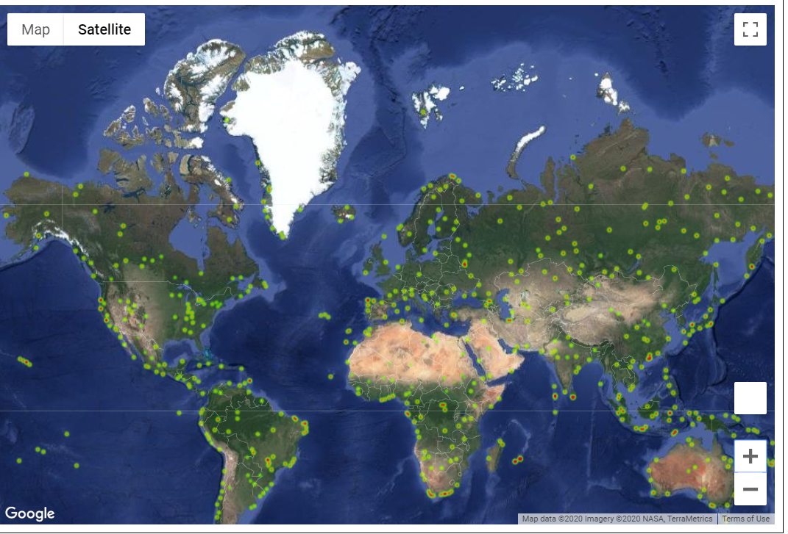

# 06_Ideal_Vacation_Weather_Python_APIs

  

 

In this assignment, the objective is to build a series of charts to analayze the correlation between the temperature and other factors:
* Scatter plots,
* Linea Regression lines,
* Heatmap.

The idea is to find the ideal vacation location with the best weather.

## Data Source(s)
* https://openweathermap.org/api

## Pre-requisite(s)
Set up a password/account (Google APIs)

## Methods
* Python/Jupyter Notebook

## Website or Links
None

## Results

