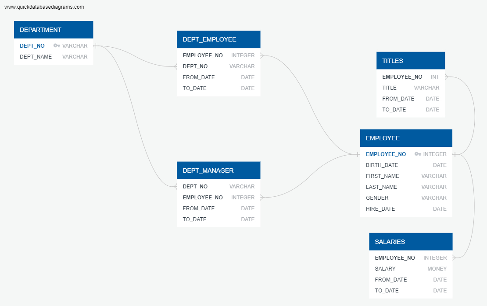

# 08_Employee_Database_SQL 

  

In this assignment, we create a SQL database along with queries.

## Data Source(s)
The data is coming from CSV files.

## Assumption
* The process is not automated.

## Methods
* Extract (Python + Jupyter Notebook)
* Transform (Python + Jupyter Notebook)
* Load (SQL + pgAdmin)

## Results
