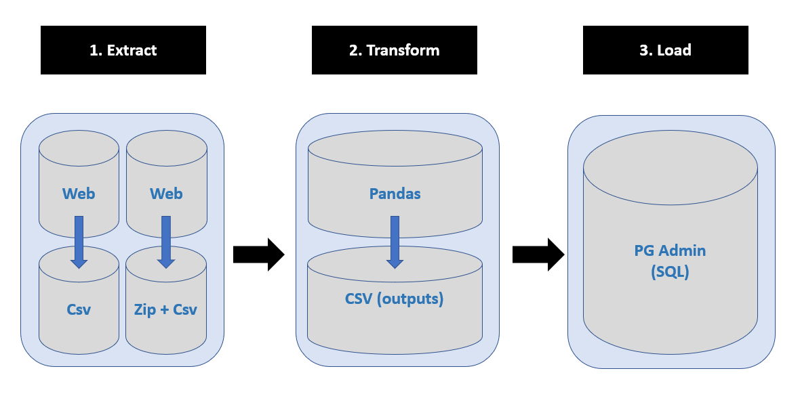

# 11_Covid_19_Unemployment_Canada_ETL_Project

  

In this assignment, we used the ETL (Extract Transform Load) approach.

## Data Source(s)
* https://www.kaggle.com/ryanxjhan/coronaviruscovid19-canada#cases.csv
* https://www150.statcan.gc.ca/t1/tbl1/en/tv.action?pid=1410001701&pickMembers%5B0%5D=1.1&pickMembers%5B1%5D=2.3

## Assumption
* The entire process must be automated

## Methods
* Extract (Python + Jupyter Notebook)
* Transform (Python + Jupyter Notebook)
* Load (SQL + pgAdmin)

## Results

