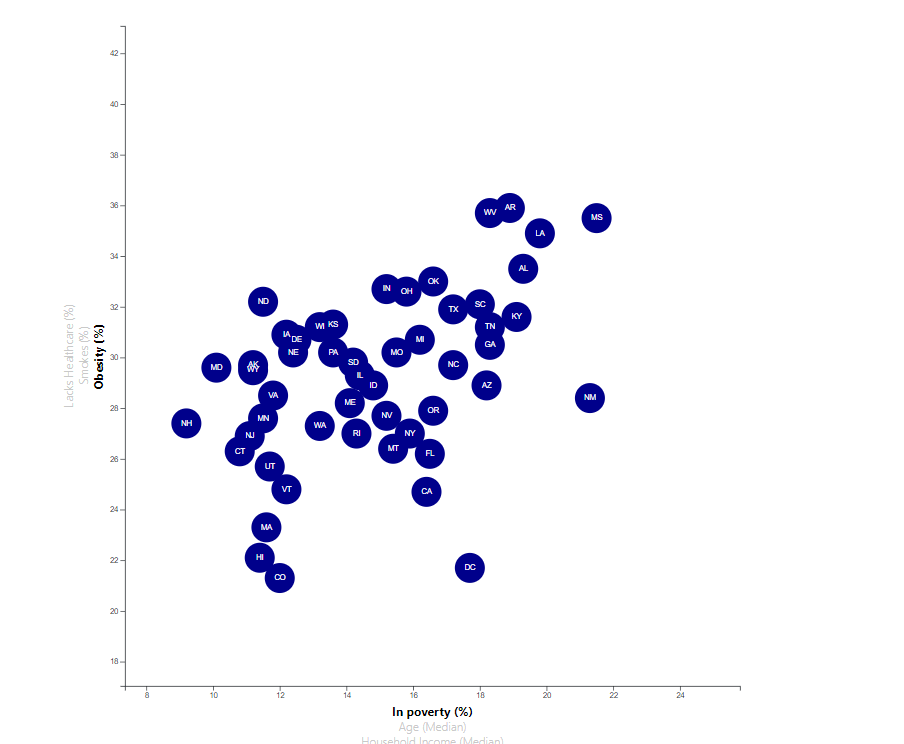

# 15_Health_Risk_JavaScript_D3 

  

 

In this assignment, Latyr is analyzing the correlation between Health Risks and Demographics. The goal is to create a Scatter Plot that enables dataset selection for each axis.

## Data Source(s)
https://data.census.gov/cedsci/all?q=2014%20ACS%201-year%20estimates&hidePreview=false&tid=ACSDP1Y2014.DP05&t=Counts,%20Estimates,%20and%20Projections&y=2014

## Methods
* Used a CSV file for data input

## Website or Links
https://latyrt.github.io/15_JavaScript_D3/index.html

## Results

