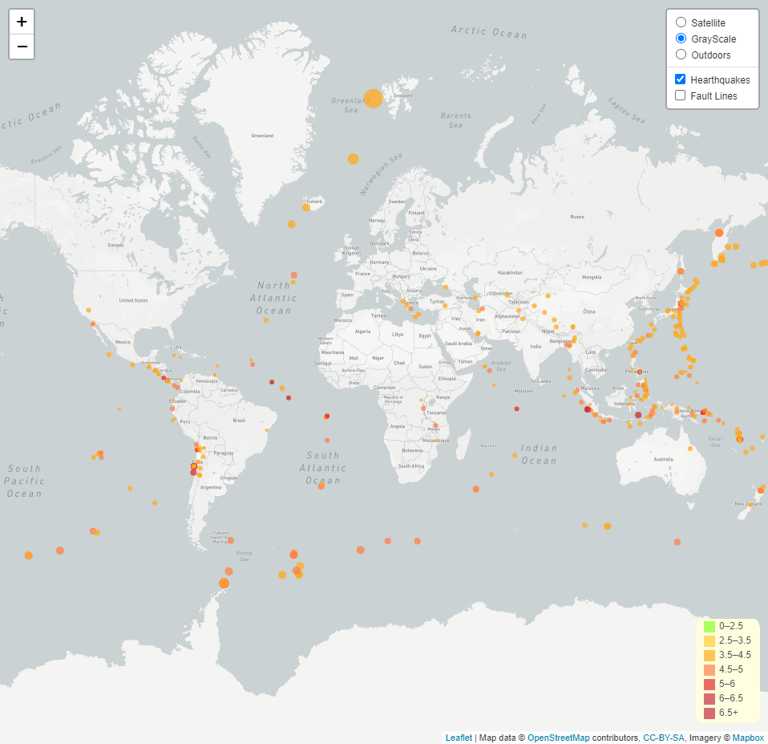

# 16_Earthquakes_Web_Mapping_Leaflet 

  

 

In this assignment, Latyr is using GeoJSON to retrieve data from a website and show earthquakes using interactive maps.

## Data Source(s)
* http://earthquake.usgs.gov/earthquakes/feed/v1.0/geojson.php

## Pre-requisite(s)
* Valid Mapbox account and key

## Methods
* Connected to an API (Data source)
* Retrieved data (GeoJSON format)
* Used data to create maps
* Plotted 2 datasets (Fault Lines + Earthquake locations)

## Website or Links
https://latyrt.github.io/17_Project_2/Global%20Page%20-%20Working%20Draft/global.html

## Results

