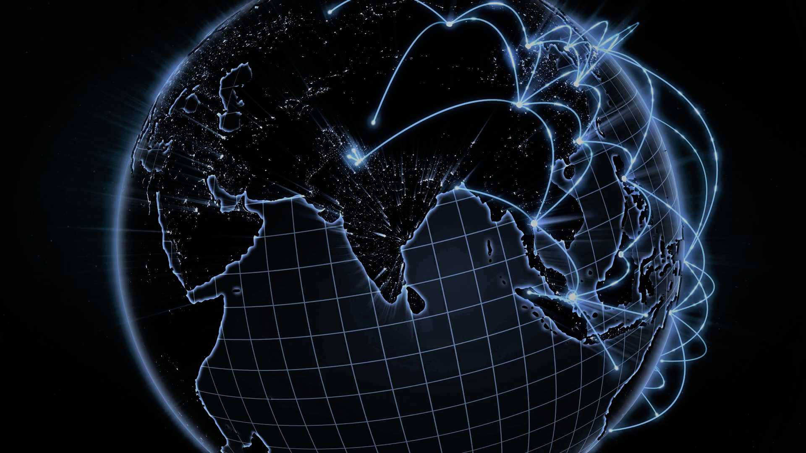

# 17_Global_Digital_Divide_Project_2 

  

 

In this assignment, we are analyzing the internet disparity accross the world. We used several metrics to compare countries with each other: Speed, Cost, ... .

## Data Source(s)
* World bank API https://datahelpdesk.worldbank.org/knowledgebase/articles/898581-api-basic-call-structures
* Web index https://thewebindex.org/downloads/
* Compare the market https://www.comparethemarket.com/broadband/content/global-broadband-index/
* Internet World Stats https://www.internetworldstats.com/stats1.html

## Pre-requisite(s)
* Set up the proper password to access your pgAdmin database

## Methods
* Used ETL approach 
    * Extract (Python)
    * Tranform (Python)
    * Load data (SQL + pgAdmin)
* Reported data
    * Created JSON files (Flask + Python)
    * Web (HTML, JavaScript, ...)

## Website or Links
https://latyrt.github.io/17_Project_2/Global%20Page%20-%20Working%20Draft/global.html

## Results

