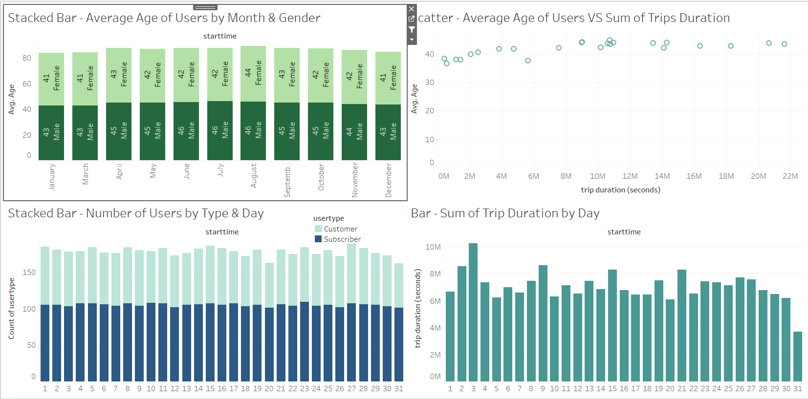

# 18_NYC_Citibike_Analytics_Tableau 

  

 

In this assignment, Latyr is analyzing the Bikes usage for New York City for the year 2019.

## Data Source(s)
https://www.citibikenyc.com/system-data

## Pre-requisite(s)
* install the required version of chromedriver.exe (https://chromedriver.chromium.org/home)

## Methods

* Created a Jupyter notebook to transform data
* Used the transformed data and uploaded it to Tableau to create final reports.

## Website or Links
https://public.tableau.com/profile/latyr#!/vizhome/TableauHomework_15950296476620/StartEndStationsAnalysis?publish=yes

User guide: (02-Analysis/03_Report_&_UserGuide_v0.1.docx)

## Results

